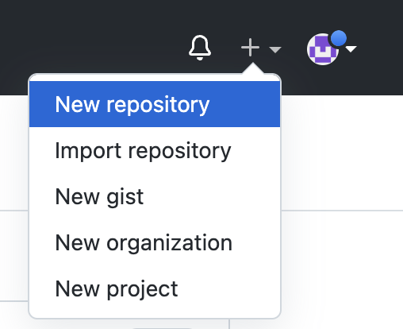
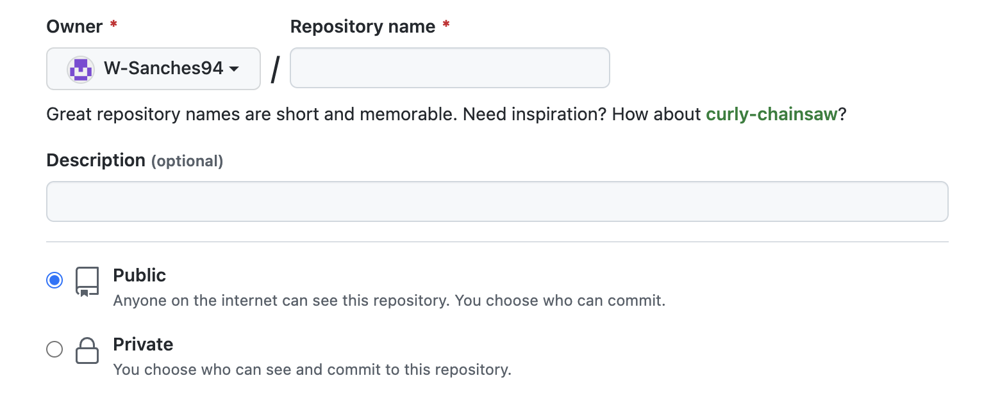
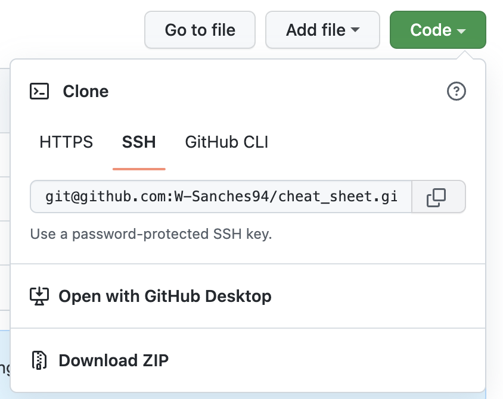
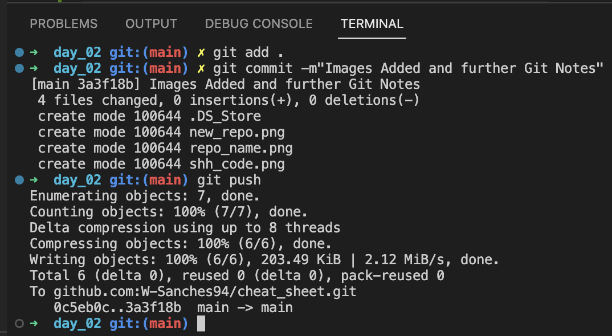

# Terminal & Git Cheat Sheet #

## Terminal ##

The terminal allows you to access both visible and hidden files without the need of a GUI (Graphic User Interface).

The way which you communicate with the terminal is determinted by what OS (operating system) the computer is running on. Linux and Mac's both operate on a UNIX based OS. The terminal on Mac's allow for the language 'Bash' to be used to communicate with the OS.

**Terminal Navigation**

```
~
home directory
```

```
pwd
Shows current location and path.
```

```
ls 
Lists all visible files with the exception of hidden files.
```

```
ls -a
Lists all files including hidden files.
```

```
ls -l
Displays more details including permissions, levels, contents, dates ect.
```

```
ls -al
List all files, including hidden files in detail.
```

```
cd
Change Directory. This followed by directory name will navigate you there. 
Used by itself it will return to the user's home directory.
```

image directory tree illustration.
```
cd .
current directory
```

```
cd ..
Return to parent directory
```

```
cd - 
Return to last location. usefull when visiting deeply nested files and accidentaly returning to home directory for example.
```

**Directory & file creation**
 
 It is crucial to follow the appropriate namning convetions to avoid errors. It is heavily not recommended to use "space" in file names.The two most popular convetions are:
 
 - snake_case

    snake case are words connected with an "_". Files and Documents following this convetion are usually lowercase for easier termninal navigation.

 - CamelCase
    
    Camel Case uses both Higher and lower case letters to seperate words.

```
mkdir "directory_name"
Create a directory / folder.
```

```
touch "my_file.txt
Create a file type dependant on the extension. txt, js, html, css, ect.
```

```
Open "directory_name/file_name"
```

```
Open . "directory_name"
```

```
mv
Allows you to Move/Rename a derectory/file.

     mv my_file.txt parent_directory
     Moves file to different destination

     mv my_file.txt my_other_file.txt
     Renames file.
```

```
rm my_other_file.txt

This deletes the file without the option for recoverability. This cannot be recovered not reversed. This will not work for directeries.
    
    rm -r my_directory
    The "r" is recursive. This will delete directeries.
```

If space should be used, it can be used to create multiple directories at once.

**General Commands**

```
History
Displays the last 10,000 commands in the terminal.
```
```
Up/Down arrow keys
Scroll through the last 5 commands in the terminal.
```
```
Ctrl L
create blank space within terminal for easier readability in the terminal.
```

```
Command +/-
Increase/Decrease text size within terminal.
```

## Git & GitHub ##

Git allows for software version control & the Git Repo allows for projects to be stored locally.

Within VS Code open Terminal.
sc

```
git init
This allows for Git to be initialized within the select directory.
```

```
git add
This 'stages' the file to let git know you want to start recording changes.
```

```
git commit
'save' the changes within the history thereby creating a snapshot. Once this takes place the file is considered unmodified once again.
    
    git commit -m"changes_name"
    Once initial commit has been completed, these serve to annotate changes made.
```

```
git push
Uploads to GitHub Repo.
```

```
git log
Allows you to see previous commitments with their author, time, date and comments. Press "Q" to return back to main terminal.
```

```
git status
Checks weher files are up to date with origin/main and latest commitments.
```

**Git Hub**



Create a new repository.



Add name and ensure it is public.



Copy & Paste SHH code from GitHub so you can then link your file(s) to your account.

